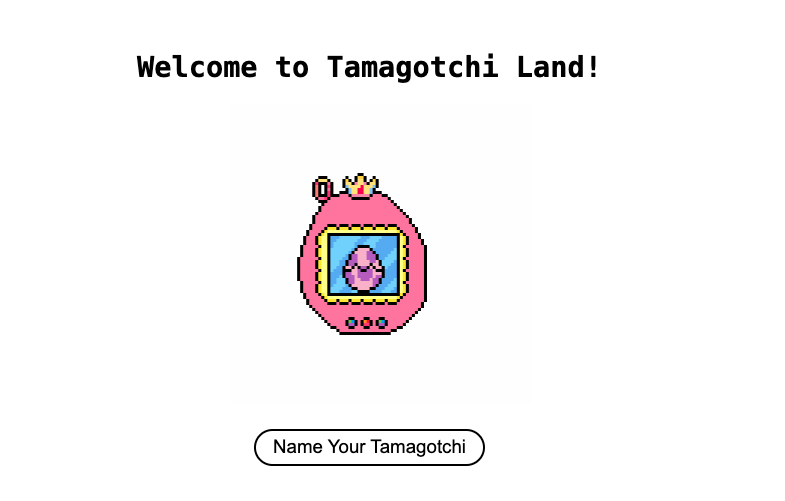

# Tamagotchi Land

A simple Interaction Page built with HTML, CSS, and JavaScript.



## Table of Contents

- [Features](#features)
- [Installation](#installation)
- [Contributing](#contributing)
- [License](#license)
- [Image](#image)

## Features

- Interact with Page and add a name to your new friend

## Installation

1. Clone the repository:

   ```bash
   git clone https://github.com/yourusername/tamagotch-land.git
   ```

2. Navigate to the project directory:

   ```bash
   cd tamagotchi-land
   ```

## Contributing

Pull requests are welcome. For major changes, please open an issue first to discuss what you would like to change.

## License

This project is licensed under the MIT License. See the [LICENSE](./LICENSE) file for details.

## Image

Image from [queensailormoon](https://www.pixilart.com/queensailormoon)
